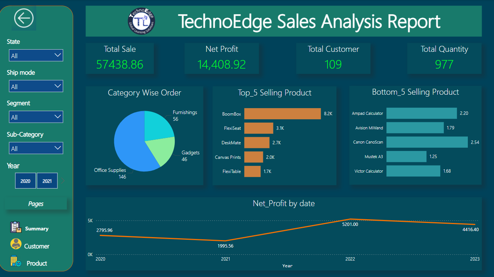
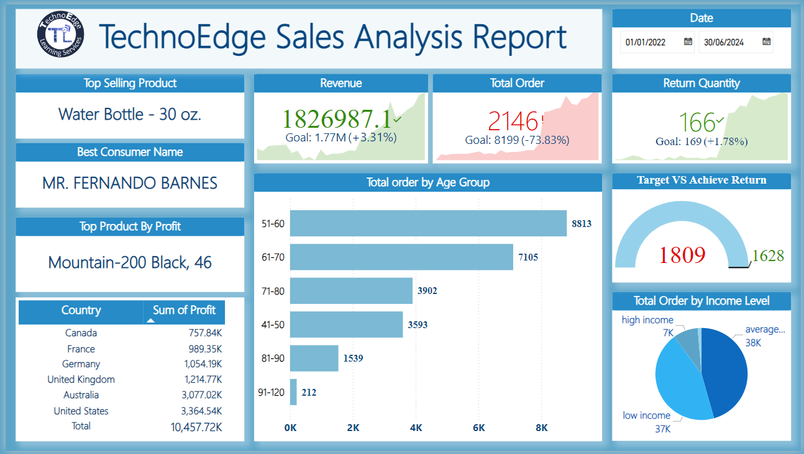
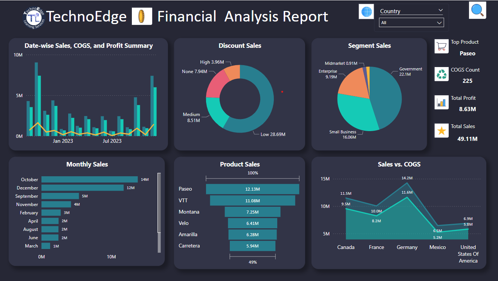
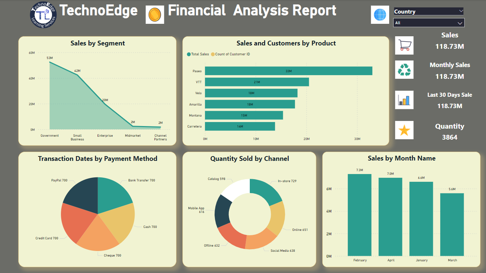
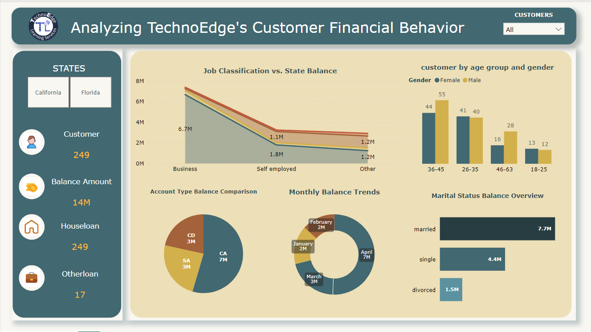
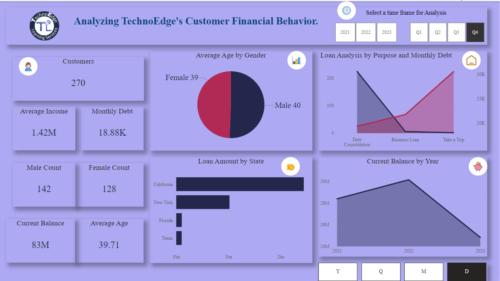
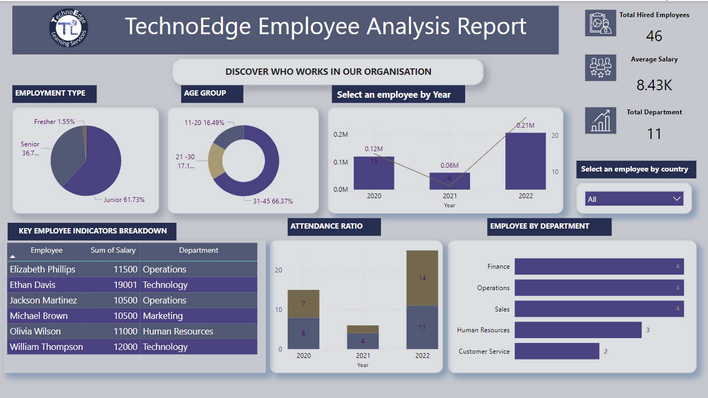
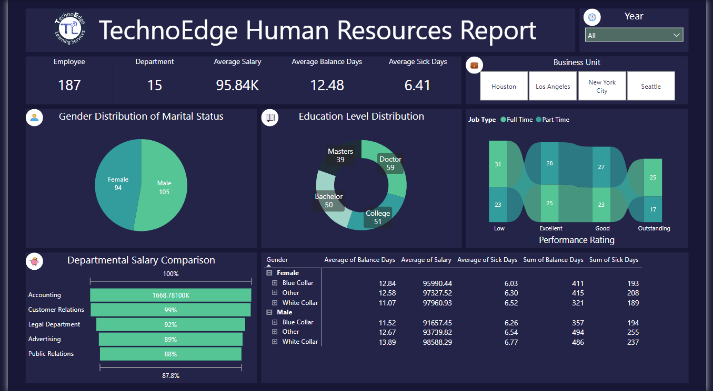
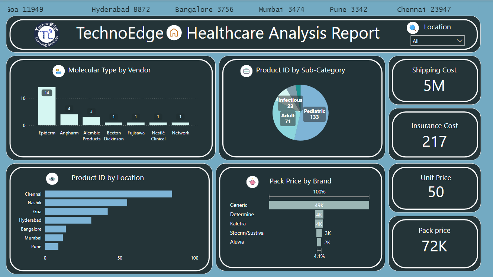

# Power BI Analytics Projects

**Nine analytics projects across sales, finance, banking, human resources, and healthcare products.**  
**Portfolio Author and Maintainer:** Ibinabo Orifama · [Email](mailto:ibisoris2026@gmail.com)

This portfolio brings together interactive Power BI reports that translate business questions into measurable views of performance. Explore the projects to see how dashboards support product comparisons, financial monitoring, customer segmentation, workforce analysis, and pricing decisions.

Ibinabo Orifama maintains this portfolio landing page. The original projects and accompanying materials are credited to **Dagogo Orifama**, whose [Complete Power BI Projects repository](https://github.com/DagogoOrifama/Complete-Power-BI-Projects) is the source of this collection. Inclusion here does not imply that the maintainer originally developed these projects.

## Project Summary

| Project | Business Domain | Description | Project Link |
| --- | --- | --- | --- |
| Sales Analysis Report | Sales & retail | Sales, customer, and product performance across regions and categories. | [Explore](./Power-BI-Sales-Analysis-Report/README.md) |
| DAX Sales Analysis | Sales & customer analytics | DAX-focused reporting on sales, returns, customer segments, and targets. | [Explore](./DAX-PowerBI-Sales-Analysis/README.md) |
| Financial Analysis Dashboard | Finance & profitability | Sales, profit, discounts, and cost of goods sold across products and countries. | [Explore](./power-bi-financial-Analysis-dashboard/README.md) |
| Financial Analysis Using DAX | Finance & sales channels | Financial reporting by segment, product, payment method, and sales channel. | [Explore](./Financial-Analysis-Using-DAX-in-PowerBI/README.md) |
| Customer Financial Behavior | Banking & customer analytics | Customer demographics, account balances, account types, and loan profiles. | [Explore](./Insight-on-Customer-Financial-Behavior/README.md) |
| DAX Customer Financial Behavior | Banking & lending | DAX-focused customer, loan, debt, balance, and time-period analysis. | [Explore](./DAX-PowerBI-Analyzing-Customer-Financial-Behavior/README.md) |
| Employee Analysis Report | Human resources & workforce | Employee headcount, salaries, attendance, and department composition. | [Explore](./Power-BI-Employee-Analysis-Report/README.md) |
| Human Resources Report | Human resources & engagement | Workforce demographics, performance, compensation, and absence indicators. | [Explore](./PowerBI-Human-Resources-Report/README.md) |
| Healthcare Product Analysis | Healthcare products & pricing | Product pricing, vendor comparisons, and shipping and insurance costs. | [Explore](./power-bi-healthcare-product-analysis/README.md) |

## Table of Contents

- [Project Summary](#project-summary)
- [Exploring the Portfolio](#exploring-the-portfolio)
- [Sales Analysis Report](#sales-analysis-report)
- [DAX Sales Analysis](#dax-sales-analysis)
- [Financial Analysis Dashboard](#financial-analysis-dashboard)
- [Financial Analysis Using DAX](#financial-analysis-using-dax)
- [Customer Financial Behavior](#customer-financial-behavior)
- [DAX Customer Financial Behavior](#dax-customer-financial-behavior)
- [Employee Analysis Report](#employee-analysis-report)
- [Human Resources Report](#human-resources-report)
- [Healthcare Product Analysis](#healthcare-product-analysis)
- [Tools and Technologies](#tools-and-technologies)
- [Skills Demonstrated](#skills-demonstrated)
- [Attribution and Licensing](#attribution-and-licensing)
- [Contact Information](#contact-information)

## Exploring the Portfolio

Each project includes a `.pbix` report, an existing PNG dashboard screenshot, a PDF dashboard export, and a project brief. Follow a project link for its original documentation, or download its Power BI file and open it in Power BI Desktop to explore the report.

**Evidence and scope:** The summaries below draw on the individual READMEs, PDF briefs, existing screenshots, and report layouts inspected inside the `.pbix` files. Objectives describe the intended analysis; they are not all confirmed as completed features. KPIs list visible report metrics or explicitly identified objectives. Findings describe the saved screenshot context and are not audited results, live data, causal conclusions, or independently validated measure calculations. The underlying data models and DAX expressions were not fully inspected.

No standalone CSV or Excel source datasets are included in this copy. Dataset descriptions come from the project documentation; source provenance, row counts, refreshability, and currency units are not independently established. Some original READMEs use filenames that differ from the actual files; the Power BI links below use the filenames present in this repository.

## Sales Analysis Report

**Overview:** Sales, customer, and product performance across regions and categories.

**Business problem:** Sales and marketing teams need a consolidated view of revenue, profit, customer activity, and product performance to identify improvement opportunities.

**Analysis objectives:** Compare regional and category performance; investigate buying patterns; rank products; and monitor sales and profitability trends.

**Dataset:** The project overview describes order and product identifiers, categories, sub-categories, sales, quantity, discount, and profit. The report also provides state, ship-mode, segment, and year filters.

**KPIs and metrics:** Total sales, net profit, total customers, and total quantity appear on the summary dashboard. Profit margin is a documented analysis objective.

**Power BI tools and techniques:** Power BI Desktop; Power Query transformation, filtering, and preparation and DAX calculations documented in the project README; summary, customer, and product pages; slicers, page navigation, cards, bar/pie/line charts, scatter plots, and report tooltips confirmed in the report layout.

**Verified screenshot findings and business relevance:** The saved summary shows BoomBox leading the displayed top-five products at approximately 8.2K. Annual net profit is highest in 2022 among the displayed years. These views support product prioritization and investigation of year-to-year profitability; they do not establish the causes of performance.

[Project documentation](./Power-BI-Sales-Analysis-Report/README.md) · [Project folder](./Power-BI-Sales-Analysis-Report/) · [Power BI report](./Power-BI-Sales-Analysis-Report/Technoedg%20Sales%20-%20%28PBI%29dashboard.pbix)

View existing dashboard screenshot

## DAX Sales Analysis

**Overview:** DAX-focused reporting on sales, returns, customer segments, and targets.

**Business problem:** Commercial teams need to compare sales and returns against goals while understanding which products, customer groups, and territories contribute to performance.

**Analysis objectives:** Analyze sales from 2022–2024, identify buying patterns, compare product performance and territory profitability, and examine returns.

**Dataset:** The problem statement describes Calendar, Customers, Product Categories, Product Sub-Categories, Products, Returns, Territories, and Sales tables covering 2022–2024.

**KPIs and metrics:** Revenue, total orders, return quantity, goal comparisons, profit by country, and orders by age group and income level.

**Power BI tools and techniques:** Power BI Desktop; DAX-focused analysis documented in the project materials; date-range slicer, KPI visuals, gauge, cards, matrix, pie chart, and clustered bar chart confirmed in the report layout.

**Verified screenshot findings and business relevance:** The saved dashboard names Water Bottle - 30 oz. as the top-selling product and Mountain-200 Black, 46 as the top product by profit. The United States has the largest displayed country profit. Product rankings therefore differ depending on the metric. The order KPI and segmented order counts appear inconsistent, so they should be reconciled before drawing conclusions about total order volume.

[Project documentation](./DAX-PowerBI-Sales-Analysis/README.md) · [Project folder](./DAX-PowerBI-Sales-Analysis/) · [Power BI report](./DAX-PowerBI-Sales-Analysis/DAX_Sales_Analysis_Project.pbix)

View existing dashboard screenshot

## Financial Analysis Dashboard

**Overview:** Sales, profit, discounts, and cost of goods sold across products and countries.

**Business problem:** Finance teams need to identify how products, discounts, costs, and geographic sales mix affect profitability.

**Analysis objectives:** Rank products by country and segment; compare discount bands, manufacturing prices, and COGS; assess monthly and daily sales patterns; and identify weaker markets or segments.

**Dataset:** The problem statement describes TechnoEdge financial details with sales, profit, manufacturing costs, products, countries, and segments. Discount bands, units sold, gross sales, COGS, and dates are named in the objectives.

**KPIs and metrics:** Total sales, total profit, top product, and a card labeled COGS Count; sales by month, product, segment, discount band, and country.

**Power BI tools and techniques:** Power BI Desktop; country slicer, cards, bar/pie/donut charts, product funnel, area chart, sales/COGS/profit combination chart, action buttons, and a report tooltip confirmed in the report layout.

**Verified screenshot findings and business relevance:** The saved dashboard identifies Paseo as the top product at approximately 12.13M in sales. Government is the largest displayed sales segment at approximately 22.1M; October leads the visible monthly ranking. These are useful starting points for examining product mix and seasonality. The COGS Count card is not a monetary COGS total.

[Project documentation](./power-bi-financial-Analysis-dashboard/README.md) · [Project folder](./power-bi-financial-Analysis-dashboard/) · [Power BI report](./power-bi-financial-Analysis-dashboard/TechnoEdge_Financial_Analysis.pbix)

View existing dashboard screenshot

## Financial Analysis Using DAX

**Overview:** Financial reporting by segment, product, payment method, and sales channel.

**Business problem:** Decision-makers need to connect financial performance with transaction activity, payment methods, and sales channels.

**Analysis objectives:** Analyze sales and transactions; compare profitability with targets; explore online and offline channels; study customer purchasing patterns; and review monthly, quarterly, and annual performance. Target comparisons and drill-through are documented objectives, rather than verified implementations here.

**Dataset:** The project documentation describes financial sales, profit, and transactions, with segment, product, country, discount band, date, quantity, payment method, and channel dimensions.

**KPIs and metrics:** The saved report displays Sales, Monthly Sales, Last 30 Days Sale, and Quantity cards, plus segment/product sales and channel quantities. Profit margin and target comparisons are documented objectives.

**Power BI tools and techniques:** Power BI Desktop; DAX-focused analysis documented in the project materials; country slicer, cards, area/bar/column charts, pie/donut charts, action buttons, and a tooltip page confirmed in the report layout.

**Verified screenshot findings and business relevance:** Government leads the displayed segment sales at approximately 53M, and Paseo leads product sales at approximately 33M. In-store has the largest displayed channel quantity at 729. The three sales cards show the same value in the saved screenshot; their time filters and measure definitions need validation before interpreting monthly or rolling-period performance.

[Project documentation](./Financial-Analysis-Using-DAX-in-PowerBI/README.md) · [Project folder](./Financial-Analysis-Using-DAX-in-PowerBI/) · [Power BI report](./Financial-Analysis-Using-DAX-in-PowerBI/Financial_Analysis_Report.pbix)

View existing dashboard screenshot

## Customer Financial Behavior

**Overview:** Customer demographics, account balances, account types, and loan profiles.

**Business problem:** Banking teams need to understand customer segments and how account balances and loan participation vary across demographics and locations.

**Analysis objectives:** Compare age groups and gender balances; examine state and country concentration; study job classification and marital status alongside loans; assess account-type popularity; and explore tenure versus balance.

**Dataset:** The problem statement lists customer ID, name, gender, age, country, state, job classification, marital status, account type, date joined, balance, and loans taken.

**KPIs and metrics:** Customer count, balance amount, cards labeled Houseloan and Otherloan, and balance breakdowns by account type, month, job classification, and marital status.

**Power BI tools and techniques:** Power BI Desktop; customer/state slicers, cards, stacked area chart, clustered column chart, bar/pie/donut charts, action buttons, and a tooltip page confirmed in the report layout.

**Verified screenshot findings and business relevance:** The saved age/gender chart shows the largest displayed group at ages 36–45. Account type CA has the largest displayed balance, approximately 7M, and married customers have the largest marital-status balance, approximately 7.7M. These describe balance concentration; they do not establish average wealth or loan eligibility. Loan-card aggregation definitions are not verified.

[Project documentation](./Insight-on-Customer-Financial-Behavior/README.md) · [Project folder](./Insight-on-Customer-Financial-Behavior/) · [Power BI report](./Insight-on-Customer-Financial-Behavior/PowerBI_Customer_Financial_Analysis.pbix)

View existing dashboard screenshot

## DAX Customer Financial Behavior

**Overview:** DAX-focused customer, loan, debt, balance, and time-period analysis.

**Business problem:** Lending teams need to monitor customer profiles, borrowing patterns, debt, and credit balances over time.

**Analysis objectives:** Analyze loan status; compare annual income by gender; visualize monthly debt; calculate current credit balance; filter by quarter; and provide bookmark navigation across calendar periods.

**Dataset:** The problem statement describes Bank Detail for customer/loan information, Customer Detail for demographics, and Calendar for month, quarter, and fiscal-year information.

**KPIs and metrics:** Customer count, average income, monthly debt, male and female counts, current balance, average age, and loan amount by state.

**Power BI tools and techniques:** Power BI Desktop; DAX-focused analysis documented in the project materials; year/quarter slicers, bookmark navigator, cards, area charts, pie/bar charts, action buttons, and line-chart tooltip page confirmed in the report layout.

**Verified screenshot findings and business relevance:** In the saved view, California has the largest displayed loan amount. The current-balance chart peaks in 2022 and falls in 2023. These patterns suggest areas for geographic exposure and balance-trend review, but do not demonstrate default risk or its causes.

[Project documentation](./DAX-PowerBI-Analyzing-Customer-Financial-Behavior/README.md) · [Project folder](./DAX-PowerBI-Analyzing-Customer-Financial-Behavior/) · [Power BI report](./DAX-PowerBI-Analyzing-Customer-Financial-Behavior/DAX_Customer_Financial_Analysis.pbix)

View existing dashboard screenshot

## Employee Analysis Report

**Overview:** Employee headcount, salaries, attendance, and department composition.

**Business problem:** HR teams need a clear view of workforce composition, compensation, and attendance to support staffing decisions.

**Analysis objectives:** Study attendance, qualifications, skills, department/gender distribution, experience, salary, age, nationality, employee details, and annual departures. The brief calls the departure analysis a turnover rate, but specifies a count of employees leaving rather than a validated rate calculation.

**Dataset:** The problem statement describes employee ID, name, position, salary, and attendance. The report also presents employment type, age group, department, year, and country.

**KPIs and metrics:** Total hired employees, average salary, total departments, salary by employee, employee counts by department/year, and attendance breakdowns.

**Power BI tools and techniques:** Power BI Desktop; country slicer, cards, employee detail table, pie/donut charts, clustered bar chart, column chart, and line/column combination chart confirmed in the report layout.

**Verified screenshot findings and business relevance:** The saved report shows 46 total hired employees, an average salary of 8.43K, and 11 departments. Its age-group chart shows ages 31–45 as the largest displayed group. Some breakdowns do not reconcile directly with the headcount card, so their aggregation and filter context should be checked before making staffing recommendations.

[Project documentation](./Power-BI-Employee-Analysis-Report/README.md) · [Project folder](./Power-BI-Employee-Analysis-Report/) · [Power BI report](./Power-BI-Employee-Analysis-Report/PowerBI_Employee_Analysis.pbix)

View existing dashboard screenshot

## Human Resources Report

**Overview:** Workforce demographics, performance, compensation, and absence indicators.

**Business problem:** HR leaders need visibility into employee demographics, performance, compensation, and absence patterns to inform workforce planning.

**Analysis objectives:** Analyze demographics, performance ratings, work-life balance, service tenure, promotion history, department distribution, compensation, absenteeism, and engagement.

**Dataset:** The project materials describe employee demographics, positions, salaries, performance ratings, satisfaction, job involvement, tenure, promotion information, sick days, and balance days.

**KPIs and metrics:** Employee count, department count, average salary, average balance days, average sick days, and departmental salary comparisons.

**Power BI tools and techniques:** Power BI Desktop; year and business-unit slicers, cards, pie/donut charts, salary funnel, performance ribbon chart, expandable matrix, action buttons, and a tooltip page confirmed in the report layout.

**Verified screenshot findings and business relevance:** The saved cards show 187 employees, 15 departments, average salary of 95.84K, average balance days of 12.48, and average sick days of 6.41. The demographic visuals total 199, which differs from the employee card; population definitions or filters need reconciliation before demographic percentages are used. No retention or promotion outcome is established by the screenshot.

[Project documentation](./PowerBI-Human-Resources-Report/README.md) · [Project folder](./PowerBI-Human-Resources-Report/) · [Power BI report](./PowerBI-Human-Resources-Report/TechnoEdge_Human_Resources_Report.pbix)

View existing dashboard screenshot

## Healthcare Product Analysis

**Overview:** Product pricing, vendor comparisons, and shipping and insurance costs.

**Business problem:** Product and procurement teams need to compare healthcare product pricing, vendor offerings, and logistics costs.

**Analysis objectives:** Compare prices across product groups and dosage forms; evaluate vendors, manufacturers, molecules/test types, discounts, and packaging; and examine geographic pricing and weight-related shipping/insurance costs.

**Dataset:** The problem statement describes product ID, vendor, brand name, unit price, dosage form, and manufacturer location, with additional pricing, weight, shipping, insurance, discount, and packaging fields discussed in the objectives.

**KPIs and metrics:** Shipping cost, insurance cost, unit price, pack price, product counts by sub-category/location, molecular-type counts by vendor, and pack-price comparisons by brand.

**Power BI tools and techniques:** Power BI Desktop; location slicer, cards, vendor column chart, sub-category pie chart, location bar chart, brand funnel, scrolling-text custom visual, action buttons, and a tooltip page confirmed in the report layout.

**Verified screenshot findings and business relevance:** The saved chart shows Pediatric as the largest labeled product sub-category at 133, while Chennai leads the displayed location counts. Generic leads the displayed pack-price comparison at approximately 49K. These support assortment and pricing review, but do not establish vendor sales leadership or discount effectiveness.

[Project documentation](./power-bi-healthcare-product-analysis/README.md) · [Project folder](./power-bi-healthcare-product-analysis/) · [Power BI report](./power-bi-healthcare-product-analysis/PowerBI_Healthcare_Analysis.pbix)

View existing dashboard screenshot

## Tools and Technologies

| Tool or technology | Evidence in this collection |
| --- | --- |
| **Power BI Desktop** | Nine `.pbix` reports with interactive report layouts, cards, charts, slicers, and navigation. |
| **DAX** | Explicitly documented in the Sales Analysis Report and the three DAX-focused projects for calculated analysis. Specific formulas are not reproduced or independently validated here. |
| **Power Query** | The Sales Analysis Report README explicitly documents transformation, filtering, and preparation. |
| **Data visualization** | Existing dashboards and report layouts include bar, column, line, area, pie, donut, combination, funnel, gauge, KPI, scatter, ribbon, table, and matrix visuals. |
| **Interactive reporting** | Slicers, page navigation, bookmark navigation, action buttons, and report tooltip pages are present in the inspected layouts. |

Excel, Power Pivot, and Power View appear in prerequisite descriptions, but their actual use is not established by the inspected project files. They are therefore not presented as verified tools used in this portfolio.

## Skills Demonstrated

The project artifacts demonstrate the following analytics capabilities. These describe the collection's content, rather than a claim that the maintainer personally built the original reports.

- **Business question framing:** Converting sales, finance, banking, HR, and product-pricing questions into documented analytical objectives.
- **KPI reporting:** Presenting sales, profit, headcount, balances, debt, and pricing metrics in stakeholder-facing reports.
- **Data preparation and modeling:** Power Query cleaning and data modeling are documented in the Sales Analysis Report; the DAX briefs also describe multi-table datasets.
- **DAX-based analysis:** Exploring calculated metrics through the documented sales, financial, and customer-financial DAX projects.
- **Segmentation and comparative analysis:** Comparing products, territories, customer groups, departments, demographic groups, and vendors.
- **Time-based analysis:** Presenting annual and monthly trends with date, year, and quarter controls.
- **Dashboard design:** Combining summary cards, comparisons, detail tables, filtering, page navigation, and report tooltips.
- **Analytical interpretation:** Connecting observable dashboard patterns to business questions while separating objectives, verified observations, and unresolved data-quality issues.

## Attribution and Licensing

**Original author:** Dagogo Orifama.  
**Original repository:** [Complete Power BI Projects](https://github.com/DagogoOrifama/Complete-Power-BI-Projects).  
**Portfolio Author and Maintainer:** Ibinabo Orifama.

The original project documentation, Power BI reports, PDFs, and screenshots retain attribution to Dagogo Orifama. This landing page presents and organizes those materials; it does not claim original authorship of the projects.

**License verification — 9 October 2026:** All nine local project READMEs state that their projects are licensed under the MIT License. However, this local copy contains no standalone license file, the [upstream repository root](https://github.com/DagogoOrifama/Complete-Power-BI-Projects) lists no standalone license file, and [GitHub's repository metadata](https://api.github.com/repos/DagogoOrifama/Complete-Power-BI-Projects) reports no detected license (`license: null`). The README statements and missing license text leave the applicable terms insufficiently documented; this homepage does not introduce a new license or resolve that discrepancy.

**Redistribution:** Do not assume unrestricted reuse, modification, or redistribution of the dashboards, datasets, screenshots, or other assets. Confirm the intended license and applicable permissions with the original author before redistributing them. If MIT licensing is confirmed, preserve the applicable copyright and permission notices. Dataset and third-party asset rights may require separate confirmation.

**Republication permission:** See the [permission and public-sharing record](./REPUBLISHING_PERMISSION.md). The author has confirmed authorship and that customer/employee data are synthetic or cleared for public sharing. These are author declarations; this portfolio does not claim a repository-wide MIT license.

## Contact Information

**Portfolio Author and Maintainer:** Ibinabo Orifama  
**Email:** [ibisoris2026@gmail.com](mailto:ibisoris2026@gmail.com)
